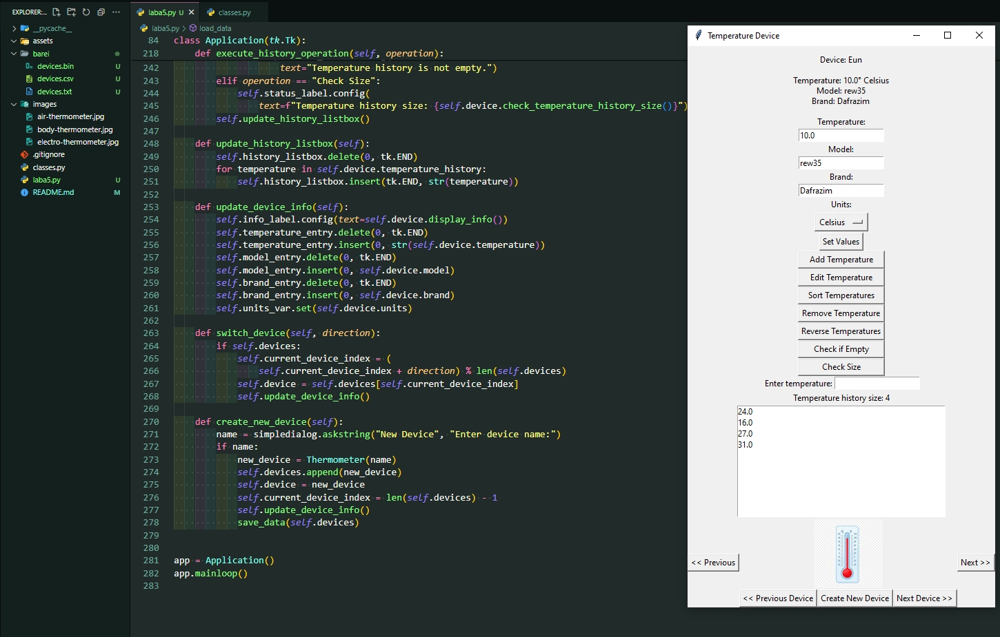

# Лабораторна робота 5. Створення програми для роботи з файлами

На цій лабораторній роботі було взято за основу програму, розроблену у лабораторній роботі №4.
Доповнено програму таким чином, щоб вона вміла:

- вводити дані (атрибути) для довільної кількості об’єктів;
- зберігати дані об’єктів у файлах різних типів: текстовому, csv та бінарному (інформація в файлах повинна дублюватись, тобто всі файли зберігають одні і ті ж самі дані);
- зчитувати дані об’єктів з файлів різних типів: текстового, csv та бінарного;
- виводити на екран дані по об’єктам (порційно, окремо для кожного об’єкта) у зручному для користувача вигляді.

Для переключення між різними об’єктами використовуються кнопки Button модуля Tkinter. Для збереження трьох файлів (.txt, .csv та .bin) створено папку, ім’я якої співпадає з прізвищем студента. Шлях до папки визначати самостійно.

Результати тестування програми:

