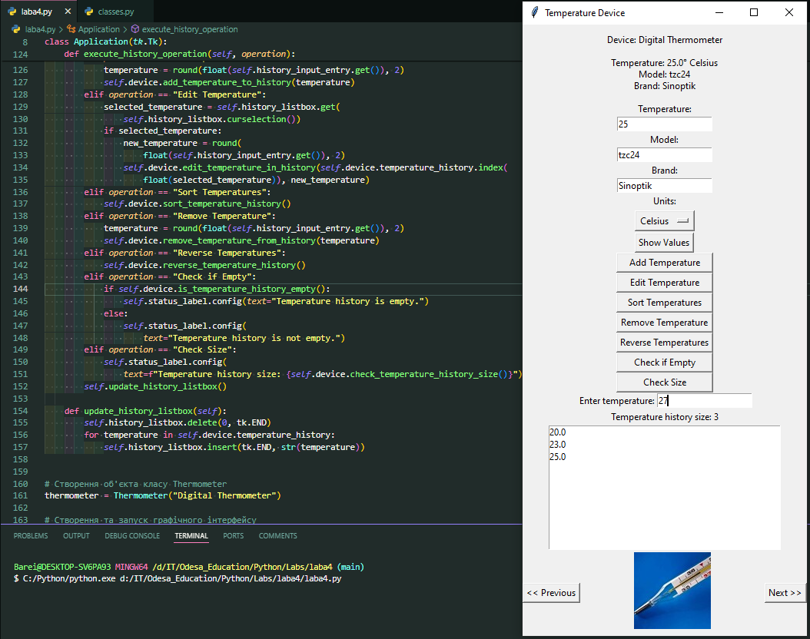

# Лабораторна робота 4. Створення графічної програми з використанням списків та кортежів

На цій лабораторній роботі було закріплено практичні навички в роботі зі створенням графічної програми з використанням списків та кортежів.

Ось такі результати тестування програми:

